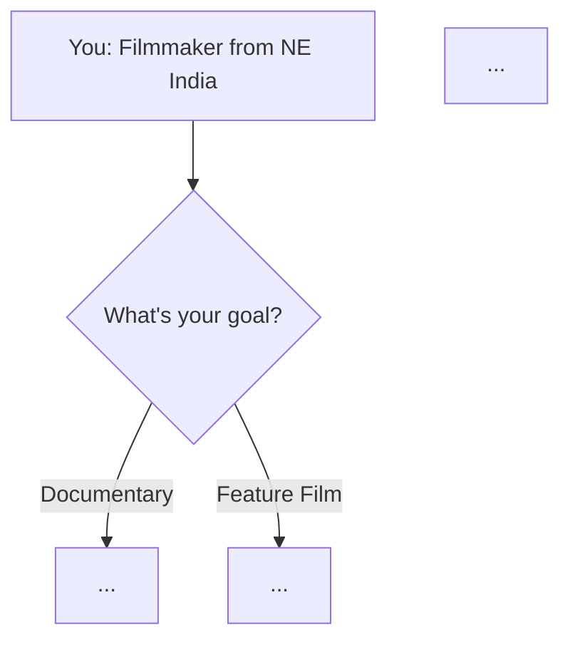

# NE Film Intelligence (NEFI) — AGENT INSTRUCTIONS
<!-- ============================================================
  INSTRUCTION AGENT — AUTO-ACTIVATION (all CLI agents & assistants)
  ─────────────────────────────────────────────────────────────
  1. LOAD skill: .grok/skills/instruction-agent/SKILL.md (or /instruction-agent)
  2. RUN: npm run agent:start
  3. READ AGENT_MEMORY.md in full — drift check before any work
  4. AFTER EVERY PROMPT: update AGENT_MEMORY.md → npm run agent:end → npm run agent:push (if major)
  5. AFTER DATABASE TOUCH: npm run agent:db-touch -- --actor "<you>" --action "<what>"
  
  Database paths that trigger instruction agent:
  server/db/, server/services/, server/ingestion/, data/*.js, admin DB APIs
  
  GitHub auto-push: https://github.com/madhurjya-nlp/ne-film-intelligence (main)
  Never push: database.sqlite, node_modules/
  ─────────────────────────────────────────────────────────────
  For Cursor: .cursor/rules/instruction-agent.mdc (alwaysApply)
  For Grok:   .grok/skills/instruction-agent/SKILL.md
============================================================ -->

---

## ⚡ IMMEDIATE ACTIONS (Run Every Session)

```
INSTRUCTION AGENT — SESSION START (npm run agent:start):

[ ] 1. Read AGENT_MEMORY.md in full — drift check vs package.json version
[ ] 2. Log session start in AGENT_MEMORY.md Session Log
[ ] 3. Scan RESEARCH_PLAN.md — identify next pending task
[ ] 4. If touching database/server → plan db-touch + memory update at end

INSTRUCTION AGENT — END OF EVERY PROMPT (before final response):

[ ] 5. Append Session Update to AGENT_MEMORY.md (summary, files, follow-up)
[ ] 6. npm run agent:end -- "what you did this turn"  (or: node scripts/instruction-agent.js session-end --summary "...")
[ ] 7. If MAJOR_CHANGES → npm run agent:push (GitHub main)
[ ] 8. After DB work → npm run agent:db-touch was run + findings in memory
```

---

## 🎯 Project Identity

**Project name:** NE Film Intelligence (NEFI) — formerly CineEduAssan  
**Owner:** Madhurjya (filmmaker, documentary maker, founder; North Lakhimpur, Assam, NE India)  
**Purpose:** Programs-first research navigator for film/media education — colleges, online degrees, institutions.  
**Audience:** Solo filmmaker from NE India with ST (Scheduled Tribe) status, low budget.  
**Primary goal:** Find low-cost, no-cost, and scholarship-eligible programs and institutions globally.  
**Secondary goal:** Grants, books, events, and country intelligence as reference layers (not primary UX).

---

## 📁 Project File Structure

```
media-guide/
├── AGENT_INSTRUCTIONS.md        ← YOU ARE HERE
├── AGENT_MEMORY.md              ← Project memory; read every session
├── RESEARCH_PLAN.md             ← Research tasks; mark complete as you go
├── index.html                   ← Homepage (cinematic dark UI, card-based nav)
│
├── guide/
│   └── media_programs_v4.html  ← Main reference guide (enhance, never delete)
│
├── research/
│   ├── continents/
│   │   ├── asia.md             ← Asia research (beyond Turkey/Malaysia)
│   │   ├── europe.md           ← Europe research (full picture)
│   │   ├── north-america.md    ← USA, Canada, Mexico
│   │   ├── south-america.md    ← Brazil, Argentina, Colombia
│   │   ├── africa.md           ← Beyond South Africa
│   │   └── oceania.md          ← Australia, New Zealand
│   ├── books/
│   │   └── open-source-library.md  ← Open-access books with direct links
│   └── papers/
│       └── research-papers.md  ← Open-access academic papers
│
├── business/
│   └── commercial-media-knowledge.md  ← Film economics, distribution, streaming
│
└── flowcharts/
    └── degree-pathways.md      ← Decision flowcharts (expand per continent)
```

---

## 🔬 Research Protocol

### For Each Continent Section

When researching a continent (`research/continents/[continent].md`), structure output as:

```markdown
# [Continent] — Film/Media Education Research
Last Updated: [YYYY-MM-DD HH:MM UTC]
Agent: [your identifier]
Status: [PENDING | IN PROGRESS | COMPLETE | NEEDS REVIEW]

## Overview
[3-5 sentences on the film education landscape of this continent for Indian students]

## Country Cards
For each country, create a card block:

### [Country Name] 🏳️
**Why it matters for Indian students:** [1-2 sentences]
**Visa difficulty:** [Easy / Moderate / Hard]
**Language barrier:** [None / Low / Medium / High]
**Cost index:** [$ Budget / $$ Mid / $$$ Premium]

#### Programs Found
| Institution | Degree | Duration | Cost | Scholarship? | Link |
|---|---|---|---|---|---|
| [Name] | [MA/Diploma/etc] | [X years] | [approx ₹ or free] | [Yes/No] | [URL] |

#### Open Source Resources for This Country
- [Book or paper relevant to this region's film tradition, with open-access link]

#### Agent Notes
[What needs follow-up, what links were dead, what was surprising]

---
```

### For Open-Source Books (`research/books/open-source-library.md`)

Verify sources using:
- Internet Archive (archive.org) — search for scanned out-of-copyright film books
- Project Gutenberg — older texts
- OpenDOAR (opendoar.org) — open access repositories
- JSTOR Open Access — journal articles
- Academia.edu — researcher-uploaded papers
- ResearchGate — scientific papers
- Directory of Open Access Books (doabooks.org)
- Muse Open (Johns Hopkins) — humanities journals
- HathiTrust Digital Library

**Required fields for each book entry:**
```markdown
### [Book Title]
**Author:** [Name]  
**Year:** [Year]  
**Category:** [Film Theory / Production / Documentary / Screenwriting / Business / History]  
**Why it matters:** [1-2 sentences]  
**Open Access URL:** [direct link to PDF or read page]  
**License:** [Public Domain / CC-BY / CC-BY-SA / etc.]  
**Relevance to NE India filmmaker:** [specific note]  
```

### For Research Papers (`research/papers/research-papers.md`)

Focus areas:
- Documentary film theory and ethics
- Indigenous filmmaking and representation
- South Asian / Northeast Indian cinema studies
- Media economics and streaming distribution
- Film festival circuit economics
- Short film as career entry point
- Postcolonial film theory

Sources:
- JSTOR Open Access (jstor.org/open)
- arXiv (for media studies crossover)
- SSRN (Social Science Research Network)
- Semantic Scholar
- BASE (Bielefeld Academic Search Engine)
- OpenAlex (openalex.org)

### For Business & Commerce (`business/commercial-media-knowledge.md`)

Research and structure the following sub-sections:

```
1. Short Film Economics
   - Festival circuit ROI
   - Grant-funded short films
   - Platform acquisition (Mubi, ShortsTV, streaming)

2. Documentary Economics  
   - Development → production → post → distribution pipeline
   - Commissioning: broadcasters, streamers, Al Jazeera, BBC, VICE
   - Co-production treaties India has signed

3. Feature Film Economics
   - Development hell and how to avoid it
   - P&A (Prints & Advertising) costs explained
   - Theatrical → streaming windows (India context)

4. Streaming Economics
   - How Netflix/Prime/Zee5/Hotstar acquire content
   - Minimum guarantees vs revenue share
   - What streamers look for from South Asian creators

5. Reels/Short-form Content Economics
   - Brand deals, creator funds, MCN structures
   - Assam/NE India brand sponsorship landscape

6. TV/Drama Production
   - Indian broadcast economics (TRP system, GEC)
   - OTT originals commissioning

7. Grants & Public Funding Mechanics
   - NFDC, CBFC, state government schemes
   - European co-production funds accessible to Indians
   - Sundance Institute grant structure

8. IP Ownership and Rights
   - WGA contracts (context for international co-productions)
   - Indian Copyright Act for filmmakers
   - How to option a book or story
```

---

## 🖼️ Flowchart Protocol

Flowcharts live in `flowcharts/degree-pathways.md`. Use Mermaid syntax so they render in GitHub and VS Code:

```markdown
## [Flowchart Name]

Expandable detail: below each flowchart, add a collapsible section:

<details>
<summary>📖 Expand: What each path means in practice</summary>
[Detailed explanation here]
</details>
```

Each continent should have its own flowchart. Decision nodes should include:
- Budget threshold (₹0 / ₹1-5L / ₹5-15L / ₹15L+)
- ST scholarship eligibility
- Language requirements
- Visa difficulty
- Duration preference

---

## ✅ Content Enhancement Rules (for guide/media_programs_v4.html)

When inspecting existing cards in the guide, add the following if missing:

1. **Application deadline** — search official site; add as `<div class="info-row">` with clock icon
2. **Typical class size** — helps understand competitiveness
3. **Notable alumni** — especially any South Asian or documentary/indie alumni
4. **What a typical week looks like** — a 2-3 sentence description of the learning experience
5. **Why this + NE India background is a fit** — a contextual note for ST candidates
6. **Dead link check** — if a link is dead, add `<!-- DEAD-LINK: [date] -->` comment and find replacement
7. **Scholarship update** — re-verify scholarship amounts against official pages (add `data-verified="[date]"`)

Tag each enhanced card with: `<!-- ENHANCED: [agent-id] [date] -->`

---

## 🏷️ HTML Data Attributes to Add

When enhancing cards in the guide HTML, use these data attributes:

```html
data-continent="asia|europe|north-america|south-america|africa|oceania|india|online"
data-cost-tier="free|budget|mid|premium"
data-degree-type="certificate|diploma|ba|ma|phd|workshop|fellowship"
data-format="online|hybrid|in-person"
data-st-eligible="yes|maybe|no"
data-scholarship-available="yes|no|partial"
data-verified="YYYY-MM-DD"
```

These enable the filterable/searchable UI to work properly.

---

## 🚨 Rules That Must Never Be Broken

1. **Never delete existing content** — only add and enhance
2. **Never fabricate links** — if you can't verify, mark `[UNVERIFIED - CHECK MANUALLY]`
3. **Never add a program without a direct URL** — approximate URLs are OK if marked `[APPROX]`
4. **Always update AGENT_MEMORY.md** before ending a session
5. **Always cite your sources** in a comment or footnote
6. **Dates matter** — every piece of data should have a verification date
7. **Exchange rates** — use current rates when converting; note the rate used and date
8. **Language** — the owner is Assamese. Any Assamese language content should use Assamese script (not Bengali)

---

## 📋 Session End Checklist

```
[ ] AGENT_MEMORY.md updated (instruction agent — non-negotiable)
[ ] npm run agent:end -- --summary "..."
[ ] npm run agent:push if major changes (5+ files, schema, tests, version)
[ ] npm run agent:db-touch if database was accessed
[ ] Verified new links return 200
[ ] Marked RESEARCH_PLAN.md items complete
```

---

*Last modified: 2026-06-18*  
*Project: NE Film Intelligence v5.1.0*  
*Instruction Agent: `.grok/skills/instruction-agent/SKILL.md`*  
*Owner: Madhurjya | North Lakhimpur, Assam*
