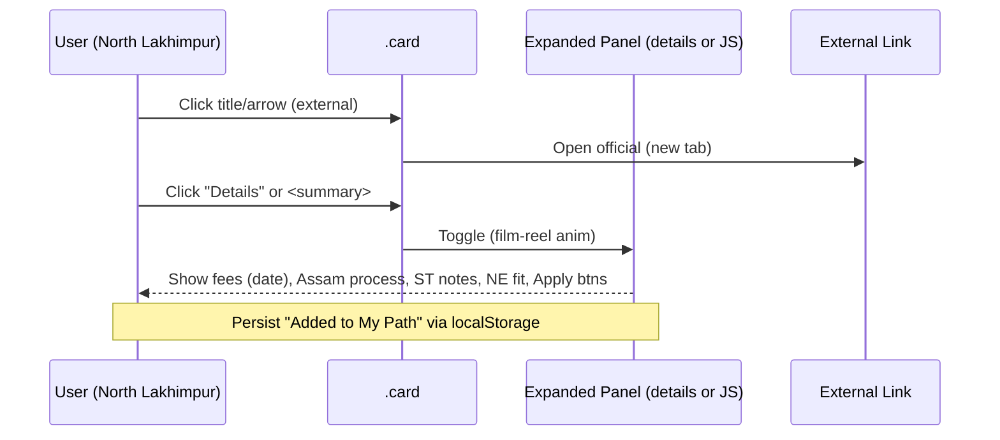

# Design Document: Enhancing "The Film Path" into a Personal Research Hub

**Title:** The Film Path — Personal Research Hub Enhancement  
**Author:** [Systems Architect Placeholder]  
**Date:** 2026-06-18  
**Status:** Draft  
**Version:** 1.0  

---

## Overview

This design transforms the existing static "The Film Path" site (cinema-edu project) from a curated collection of program/grant/book/event cards into a **detailed personal research hub** tailored for its owner: a 25-year-old ST (Scheduled Tribe) Assamese filmmaker based in North Lakhimpur, Assam, Northeast India. The primary focus is enabling access to international film/media education, networks, knowledge, and infrastructure — with strong emphasis on **online, flexible, and hybrid modes** suitable for remote personal use today.

The solution keeps the site 100% lightweight and static (no backend, no Netlify functions). It deeply integrates the existing research corpus (`research/Film_Education_Programs_Categorized_0-9Lacs_Assam_NE.xlsx`, `Cultural_Context_Assam_NE_Cinema_Media.docx`, `Pathways_Abroad_Assam_NE_Ground_Reality.docx`, `programs-research.md`) into the UI. Every institute/university/card becomes both **clickable** (direct external official or deep links) **and expandable** to deliver rich, actionable metadata: current verified fees (with date stamps), duration/format (online/hybrid/in-person), Assam-specific application logistics (Guwahati HRD/MEA attestation, VFS centers in Delhi/Kolkata, GAU flight estimates), ST/NOS eligibility, why the program fits NE documentary/indigenous storytelling and infra needs, scholarship tips, direct "Apply"/contact actions, network value (festivals, co-productions), and Assam relevance.

Visual design is elevated to a more premium "dark archive" cinematic aesthetic **strictly within the constraints of `css/design-system.css`** (celluloid yellow `#F7C948` accents, film grain SVG overlay, `Space Grotesk` display + `Courier Prime` mono, sharp 0-radius edges, existing `--ease`, `--dur`, tokens). UX improvements target higher information density, stronger hierarchy, smoother film-reel-inspired micro-interactions for expand/collapse, a persistent "My Recommended Path" personal dashboard, and new filters ("Online Only", "ST Friendly", "Infra/Knowledge/Network").

JS infrastructure and data-attribute conventions from `js/app.js` (`.reveal`, `initAccordions()`, dormant `initFilters()`/`initSearch()` that target `.filter-bar`/`.search-input` + `[data-category]`/`[data-searchable]`) and `AGENT_INSTRUCTIONS.md` will be **activated** (via addition of corresponding markup) and extended, along with card markup (`.card-grid`, `.card`, `.card__*`). The filter/search logic exists in JS but has no active `.filter-bar` or `.search-input` markup in current HTML pages.

---

## Background & Motivation

**Current state (as of 2026-06-18):**
- Static HTML pages: `index.html` (hero + nav cards), `programs.html` (bands, Erasmus, regions, NOS, Cultural Context section, timeline accordions), `grants.html`, `books.html`, `events.html`.
- Shared foundation: `css/design-system.css` (full dark celluloid theme with grain, tokens, `.card`, `.accordion`, `.page-hero`, responsive), `js/app.js` (IntersectionObserver reveals, mobile menu, accordion toggle, filter/search with data attrs, keyboard nav, dates).
- Content is rich but flat: cards (many `<a class="card">` for clickability, some `<div class="card">`) show title/meta/body/foot with limited detail. Some external links are deep (e.g. `https://www.docnomads.eu`), many point to portals or are incomplete.
- Recent additions (per AGENT_MEMORY and HTML): Cultural Context (Joymoti 1935, Jyoti Chitraban, DBHRGFTI Guwahati as only NE govt institute), Cost Bands (0-3L/4-6L/7-9L), Germany €0-tuition public MA, updated NOS urgency (deadline ~30 Jun 2026, overseas.tribal.gov.in), ground-reality notes.
- Data lives externally in research/ (xlsx has 18+ categorized rows with columns: Cost Band, Institution, Country, Program, Duration, Est Tuition (INR Lacs), Notes for NE/Assam Filmmaker (Ground Reality), Link/Source). Docx files contain full article prose on cultural context + practical pathways (attestation from Guwahati, flights ~₹50-90k to Europe from GAU, VFS logistics, ST proofs).
- Profile-driven: Owner is ST, solo, low-budget (comfortable 0-5L self; up to 15L w/ scholarship), documentary focus, runs GOSO/Public Signal, fluent Assamese+English, remote North Lakhimpur (travel to Guwahati 6-12h), wants mostly online/flex/hybrid now.
- Pain points: Cards not uniformly clickable + lack depth (no current fees with dates, no Assam-from-ground process, no explicit "why NE stories fit", no structured network value). Information density is low for a "working document." No personalized dashboard. Visuals functional but not premium "archive" in dense sections. Static data hard to maintain/expand without duplication. Existing accordions (in programs.html ~715-778) use custom `.accordion__*` but are limited to timeline.
- Current UI integration status: `.filter-bar` / `.filter-btn` CSS rules exist (design-system.css ~667) and `initFilters()`/`initSearch()` are implemented in app.js (targeting data attrs), but **no** `.filter-bar`, `.filter-btn`, `.search-input` or equivalent markup is present in index.html, programs.html, grants.html, books.html, or events.html (verified via grep). These are dormant infrastructure to be activated by adding markup in this enhancement. Data attrs on cards are already used for categories/search.

### Known Technical Debt / Stale References
Directory inspection (list_dir) and code grep confirm no `guide/` directory and no `research/continents/` subdirectory exist (as of 2026-06-18). `index.html` contains multiple stale internal links:
- Nav and mobile: `<a href="guide/media_programs_v4.html">Full Guide</a>` (and footer links).
- Quick nav cards and links: 8+ occurrences pointing to `guide/media_programs_v4.html` (including anchors `#mentorship`, `#business`, `#action-plan`, `#scholarships`).
- Continent tracker: 6 links to non-existent `research/continents/asia.md`, `europe.md`, `north-america.md`, `south-america.md`, `africa.md`, `oceania.md` (`.cc` elements).
AGENT_MEMORY.md flags some dead links (e.g. Himalayan Story Lab) and "Various 'Apply →' buttons", but does not explicitly call out these legacy guide/ and continents/ references from v4 inventory. Current built pages (programs etc.) do not reference them. This enhancement scope focuses on the live pages; stale links are navigation debt.

**Recommendation for cleanup:** Include in PR 1 (CSS foundation + early audit) or dedicated subtask of PR 5: either remove/update the broken links (e.g. remove continent grid or point to research/ placeholder, deprecate Full Guide or redirect to programs.html) or add `<!-- STALE: legacy v4 guide reference; not in scope for this enhancement -->` markers. Rationale for not auto-cleaning in core PRs: AGENT_INSTRUCTIONS "never delete existing content" and owner may have external references; explicit decision needed. Update all "Current state" descriptions to reflect verified present files only.

**Why this change:** Owner needs an actionable, living personal tool for navigating education paths from Assam realities (limited local infra beyond DBHRGFTI, patchy internet, attestation travel costs, ST leverage via NOS). Research is already detailed in files; UI must surface it without overwhelming while enabling deep dives. Goal: elevate from "guide" to "personal research hub" that feels like a filmmaker's working archive — premium, precise, filmic.

References: `AGENT_MEMORY.md` (profile, research status), `AGENT_INSTRUCTIONS.md` (research protocol, data attrs like `data-format`, `data-st-eligible`), `programs-research.md`, xlsx/docx sources.

---

## Goals & Non-Goals

### Goals
- Deliver rich, expandable, clickable cards for **all** institutes/universities (target ~18+ from xlsx + Erasmus + local like DBHRGFTI + online certs).
- Embed actionable Assam/NE details: exact fees (date-verified), format status, application steps (attestation Guwahati → MEA, VFS, GAU flights), ST/NOS eligibility, NE story/infra fit, scholarships, Apply links, network value.
- Create "personal research hub" feel: "My Recommended Path" dashboard (profile-based recs prioritizing online/flex, ST-friendly, doc focus), persistent personal notes (localStorage), filters (`Online Only`, `ST Friendly`, `Infra/Knowledge/Network`).
- Enhance design **within** `design-system.css`: elegant card treatments (better long-form typography, subtle sprocket/reel borders), film-like micro-interactions (smooth expand with easing), stronger visual hierarchy, higher density without clutter.
- Data-driven approach: Cards reference xlsx categories; use JS to hydrate or maintain static mirrors with source citations.
- Maintain 100% static, lightweight, accessible (existing ARIA, keyboard, reduced-motion), mobile-first.
- Prioritize online/flexible/hybrid + low-cost (0-3L band) + NOS/Erasmus.
- Quantifiable targets: Instant load (static), expand <300ms perceived, 100% cards have deep links + expand, date-stamped data.

**Primary rich expandable treatment scope (for "every institute/university and card" requirement):**
- Programs.html: ~18-25 institute/program cards (Erasmus Mundus: 5, Govt/Scholarship: 4 incl. NOS, Baltic/Caucasus/Iberia/others regions: ~8-10, online/local/affordable: ~7 incl. DBHRGFTI, Bir Tikendrajit, Germany public, cert stacks). All must be clickable + expandable.
- Selective on other pages: 5-7 key items (e.g. major ST grants on grants.html, key festival labs on events.html, select books with strong NE relevance on books.html). Books.html (30+ theory/practical cards) and most grants remain simple cards (internal footer links preserved). Legacy ticker claims of "80+ Programs" refer to historical v4 inventory; this enhancement targets the current researched ~20 programs/institutes for rich treatment (see Issue 4 clarifications below and PR 5 for ticker deprecation).

### Non-Goals
- No backend, databases, server rendering, or external APIs (keep static; no Netlify functions).
- No new CSS files or breaking changes to design-system.css tokens/palette (celluloid yellow, grain, fonts, sharp edges only).
- Do not rebuild entire site from scratch or delete legacy content (enhance in place; follow AGENT_INSTRUCTIONS "never delete").
- Do not add heavy JS libs or complex state (extend `app.js` patterns).
- Not a public multi-user platform or job board (personal use primary; owner context in memory).
- No full continent deep-dives in this phase (use existing research/ + xlsx).
- No fabrication of fees/links (always cite research sources + `data-verified` dates).

---

## Proposed Design

### High-Level Architecture

The enhancement layers rich metadata + interactivity onto existing static pages without altering core files structure. Data flows from research/ artifacts → enhanced HTML markup + JS hydration.

```mermaid
flowchart TD
    subgraph Research["Research Corpus (source of truth)"]
        X[Film_Education_Programs_Categorized_0-9Lacs_Assam_NE.xlsx<br/>18+ rows + Notes]
        C[Cultural_Context_Assam_NE_Cinema_Media.docx]
        P[Pathways_Abroad_Assam_NE_Ground_Reality.docx]
        M[programs-research.md]
    end

    subgraph Site["Static Site (enhanced)"]
        IDX[index.html<br/>+ My Recommended Path dashboard]
        PROG[programs.html<br/>enhanced cards + Cultural + Bands]
        OTH[grants.html, books.html, events.html<br/>selective rich cards]
        CSS[css/design-system.css<br/>extended cards, details, film-reel]
        JS[js/app.js<br/>extended: expandPanels, newFilters, personalNotes]
    end

    X -->|categorized rows| PROG
    C -->|history, DBHRGFTI, NE fit| PROG
    P -->|Assam logistics: attestation, VFS, GAU flights, NOS| PROG + IDX
    M -->|context + updates| All

    PROG -->|data attrs + inline rich panels| Cards
    JS -->|initRichCards + toggleExpand + localStorage notes| Cards
    CSS -->|premium card variants + .film-reel-expand + details| Cards

    style X fill:#111,color:#F7C948
    style PROG fill:#1A1A1A
```

**Page roles (incremental):**
- `index.html`: Add "My Recommended Path" hero/dashboard section (profile-aware recs: e.g. DBHRGFTI + Bir Tikendrajit online + DocNomads via NOS + Google/Adobe certs + EICTV workshops). Quick filters + notes textarea.
- `programs.html`: Primary hub. Retain existing Cultural Context, Bands, Erasmus, regions, NOS, timeline. Replace/upgrade card grids to "rich cards". Add top-level filter bar for Online/ST/Infra.
- Other pages: Selective upgrades (e.g. key institutions in grants/books/events become rich).

### Card Design & Expandable Pattern (Core Primitive)

**Base (existing):**
```html
<a href="https://official-site" class="card" data-category="europe" data-format="online" data-st-eligible="yes" data-cost-tier="0-3" data-searchable>
  <span class="card__tag ...">Online · ST</span>
  <h3 class="card__title">...</h3>
  <div class="card__meta">...</div>
  <div class="card__body">...</div>
  <div class="card__foot">
    <span class="card__detail"><b>₹0.5L/yr</b> · Verified 2026-06</span>
    <span class="card__arrow">→</span>
  </div>
</a>
```

**Proposed enhancement (hybrid clickable + expandable):**
- Outer `<a>` for primary deep link (official program page or apply). Prevent default on expand control.
- Or split: title/meta always link; body + dedicated "Details" button toggles inline `.card__expanded`.
- For non-link cards (e.g. NOS div): make header linkable where possible + always expandable.
- Expand uses either:
  1. Native `<details class="film-reel-details">` + `<summary>` (accessible, no extra JS for basic) — preferred for simplicity.
  2. Augmented custom (extend `initAccordions` or new `initRichExpanders`) with film-reel metaphor (sprocket holes via repeating CSS `background`, subtle rotate/scale on open using `--ease`).
- Rich content inside (sourced from xlsx Notes + docx + programs-research.md):
  - **Fees & Dates**: "Est. ₹46,000 total (Bir Tikendrajit, verified 2026-06 from research/xlsx; confirm on birtikendrajituniversity.ac.in)"
  - **Format**: "Online (2yr, flexible) · Hybrid thesis option noted"
  - **Duration**: "2 years"
  - **Application from Assam**: "1. Attest degree in Guwahati (HRD) → MEA Delhi. 2. VFS (Kolkata/Delhi for most). 3. GAU→DEL ~₹8-15k + intl. Prep 3-6mo. ST cert from district Lakhimpur."
  - **ST/NOS**: "Eligible. NOS covers full if QS Top 1000 + 55%. Age 25 ✓. No bond."
  - **NE/Assam Fit**: "Strong for indigenous/postcolonial docs. NE oral traditions + Brahmaputra ecology map to program themes. Underrepresented voice advantage."
  - **Scholarships/Tips**: "NOS primary. Local state supplements. Financial aid on Coursera stack."
  - **Network Value**: "Connects to Baltic/Nordic fests via BFM; co-pro potential with Global South cohorts."
  - **Actions**: "Apply → [deep link]" + "Contact admissions email" + "Add to My Path" (JS button).
  - Source: "See research/..." + `data-verified="2026-06-18"`

**Film-reel micro-interaction:**
- Summary trigger has film-strip visual (thin repeating bars or `::before { content: '⦿ ⦿ ⦿'; }` in mono).
- On open: subtle max-height + opacity + slight "reel advance" translate using existing `--ease-spring`.
- Keep motion respect for reduced-motion users (existing in app.js + CSS).

**Data attrs to extend (build on AGENT_INSTRUCTIONS):**
`data-format="online|hybrid|in-person"`, `data-st-eligible`, `data-cost-tier`, new: `data-focus="infra|knowledge|network"`, `data-online="true"`.

### Card Markup Variants
Current markup is mixed (verified via grep/reads of programs.html, books.html, grants.html, events.html, index.html). This must be handled to avoid invalid HTML (nested interactive elements inside `<a>`).

1. **External-link institute card** (most programs.html Erasmus/regions; current pattern: top-level `<a class="card">`):
   ```html
   <!-- Before -->
   <a href="https://www.docnomads.eu" class="card" data-format="in-person" ...>
     ...
     <div class="card__foot"><span class="card__detail">...</span><span class="card__arrow">→</span></div>
   </a>

   <!-- After (hybrid) -->
   <a href="https://www.docnomads.eu" class="card card--rich" data-format="in-person" data-online="false" data-st-eligible="yes" data-focus="knowledge network" ...>
     ... (title/meta/body unchanged) ...
     <div class="card__foot">
       <button type="button" class="card__expand" aria-expanded="false" aria-controls="exp-docnomads">Details ▾</button>
       <span class="card__arrow" aria-hidden="true">→</span>
     </div>
   </a>
   <details id="exp-docnomads" class="film-reel-details">
     <summary class="sr-only">Expand details for DocNomads</summary>
     <div class="rich-content">... fees, Assam process, NE fit ...</div>
   </details>
   ```
   JS: `expandBtn.addEventListener('click', e => { e.preventDefault(); /* toggle details */ });` (prevent default to keep outer <a> navigation working for title click).

2. **Non-link info card** (NOS, some govt/free tools in programs.html; current: `<div class="card st-glow">`):
   ```html
   <!-- Before -->
   <div class="card st-glow" data-category="india" ...>
     ... body ...
     <div class="card__foot"><span class="card__detail">Via scholarships.gov.in</span><span class="card__arrow">→</span></div>
   </div>

   <!-- After -->
   <div class="card st-glow card--rich" data-st-eligible="yes" ...>
     ...
     <div class="card__foot">
       <button type="button" class="card__expand" ...>Details ▾</button>
       <a href="https://overseas.tribal.gov.in/" class="card__apply" target="_blank" rel="noopener">Apply →</a>
     </div>
   </div>
   <details ...>...</details>
   ```

3. **Card with internal footer links** (books.html style; events similar):
   ```html
   <!-- Before (books) -->
   <div class="card" data-category="theory" data-searchable>
     ...
     <div class="card__foot">
       <a href="https://archive.org/..." class="card__detail">Read on Archive.org</a>
       <a href="https://z-lib.id/..." class="card__arrow">→</a>
     </div>
   </div>

   <!-- After (keep simple or enhance selectively; avoid wrapping whole in <a>) -->
   <div class="card card--rich" ...>
     ...
     <div class="card__foot">
       <button ... class="card__expand">NE Relevance ▾</button>
       <a href="archive..." class="card__detail" target="_blank">Read →</a>
     </div>
   </div>
   ```
   Guidance: Prefer non-<a> root + prominent "Visit official →" when rich expand is primary action. For `<a class="card">` cases, use `pointer-events: none` or JS stopPropagation on expand controls + `role="button"` + keyboard handling. Always include `aria-controls`, `aria-expanded`. Test with screen readers. Reference existing keyboard nav in app.js.

**Mermaid: Card Interaction Sequence**


### Personal Dashboard & Filters ("My Recommended Path")

- On `index.html` (below hero or in dedicated section) and top of `programs.html`: Profile summary + recommended stack.
  Example (static + filterable):
  - Tier 0 (Immediate, ₹0): DBHRGFTI local contact + Digital Film School Africa (online free) + Adobe/Google certs.
  - Tier 1: Bir Tikendrajit MA Online (~₹46k) + EICTV workshops.
  - Tier 2 (Funded): DocNomads (Erasmus) via NOS application.
  - "Build My Path" checklist with checkboxes (localStorage persist).
- New/activated filter bar (introduce first concrete `.filter-bar` + `.filter-btn` + optional `.search-input` markup in programs.html and index.html; wire to `initPersonalFilters()` / existing dormant logic):
  - "All | Online Only | ST Friendly | Infra | Knowledge | Network"
  - Combine with existing category/continent. First usage must demonstrate `data-online` / `data-focus` attrs on sample cards.
- Persistent notes: Small `<textarea id="personal-notes">` in sidebar or footer of key pages. `localStorage.setItem('filmPathNotes', ...)` on input (debounced). Export button (download .txt).
- "Personal Dashboard" card: Shows "Current focus: Mostly online/hybrid from remote Assam. ST leverage: NOS + underrepresented stories."

### Visual & Typography Enhancements (within design-system.css)

- Card extensions (new classes in page `<style>` or global):
  - `.card--rich` for long content: tighter body leading, `font-size: 13px` body in expand, better `<dl>` or `<ul class="rich-list">` inside panels.
  - Subtle border treatments: left celluloid + top thin film-edge.
  - Hierarchy: `card__title` scale preserved; meta smaller; body uses `--archive` with better line-length (max 70ch in panels).
- Film grain already global; enhance card hovers with very subtle glow using existing `--celluloid-glow`.
- Micro: Expand icon evolves to sprocket (CSS or emoji); use existing transitions.
- Density: Use existing `.container--narrow`; add collapsible "Research Sources" footers citing exact files.
- No new fonts/colors.

**Mermaid: Site Information Architecture**
```mermaid
graph TD
    IDX[Index: Personal Hub + Recs] --> PROG[Programs: Master List + Rich Cards]
    PROG -->|filter| Erasmus
    PROG -->|filter| Regions + Online
    PROG -->|filter| Local NE
    IDX --> GRANTS[Grants]
    IDX --> BOOKS
    IDX --> EVENTS
    PROG -->|expand| RichPanel[Fees + Assam Logistics + ST + NE Fit]
    RichPanel -->|links| OfficialSites
```

### Data-Driven Implementation

- Primary: Static HTML enhanced manually from xlsx rows (cite source in comments).
- Note on JSON (see Key Decision #6 and Non-Goals): `research/programs.json` (or inline script) is explicitly **deferred** / future-only precisely because it would introduce a build/export step and reduce the hand-authored HTML simplicity valued for non-dev owner editing from remote Assam. Primary remains manual static with source citations. Inline `<script type="application/json">` (no new files) is the only low-complexity option if ever activated.
- Update script in research/ or manual: on change, sync key fields.
- All rich panels include "Last verified: 2026-06-18 | Source: research/Film_...xlsx + Pathways docx".

---

## API / Interface Changes

No external APIs (static site). Internal UI changes:

**Before (example card foot):**
```html
<div class="card__foot">
  <span class="card__detail"><b>~₹2.3-3.8L/yr</b> · Scholarships available</span>
  <span class="card__arrow">→</span>
</div>
```

**After (rich + clickable):**
```html
<a href="https://tlu.ee/bfm" class="card card--rich" data-format="hybrid" data-st-eligible="yes" data-focus="knowledge network" ...>
  ...
  <div class="card__foot">
    <button class="card__expand" aria-expanded="false" aria-controls="exp-1">Details ▾</button>
    <a href="https://..." class="card__apply">Apply →</a>
  </div>
</a>
<details id="exp-1" class="film-reel-details">
  <summary>...</summary>
  <div class="rich-content">
    <dl>
      <dt>Current Fees (2026-06)</dt><dd>~€2,500-4,000/yr (verify studyinestonia.ee)</dd>
      ...
      <dt>From North Lakhimpur</dt><dd>Guwahati attestation (6-12h travel) + VFS Kolkata/Delhi + GAU flights. NOS eligible.</dd>
    </dl>
    <a href="apply-url">Direct Apply</a>
  </div>
</details>
```

Extend `app.js`:
- `initRichExpanders()` (builds on `initAccordions`).
- `initPersonalFilters()` + `initNotes()`.

Filter buttons reuse `.filter-bar` + `data-filter`.

---

## Data Model Changes

No schema/DB. "Model" is the research artifacts + HTML/JS representation.

- **Enhance xlsx usage**: Treat as canonical. Add columns in future (e.g. "Verified Date", "Online Flag", "ST Notes", "Assam Logistics Summary", "NE Fit Sentence") if regenerating via `create_*` scripts.
- HTML cards become the rendered view: duplicate key fields + full rich text from docx prose snippets.
- Migration: No breaking; additive. Existing cards keep working. Add `data-verified` everywhere (per AGENT_INSTRUCTIONS).
- Personal data: `localStorage` keys: `filmPathNotes`, `myPathChecks` (array of program ids). No export to files unless button added.

Storage estimates: Negligible (static HTML + <1KB LS).

---

## Alternatives Considered

### 1. Fully JS-rendered cards from embedded JSON (data-driven only)
**Description:** Parse xlsx → JSON at build (manual or script), render all cards + panels dynamically via JS in `app.js`. Minimal static HTML.

**Trade-offs:**
- Pros: Single source of truth (easy sync with research/xlsx), filters extremely powerful, easy to add new programs.
- Cons: Loses graceful degradation (JS off = blank), more complex initial load, harder for non-dev owner to edit content directly, deviates from current "hand-authored HTML" pattern in programs.html. Increases bundle size slightly.
- Why not chosen: Site must remain simple static for remote Assam low-connectivity. Owner may hand-edit. Existing HTML investment high. Hybrid (static + optional hydrate) preferred.

### 2. Native `<details>/<summary>` everywhere + zero custom JS for expand (pure HTML)
**Description:** Convert all cards/sections to use native details. Style heavily. No new app.js functions.

**Trade-offs:**
- Pros: Zero JS, excellent a11y out of box, simple, works offline.
- Cons: Less control over film-reel metaphor + coordinated animations with existing reveal/filter code. Harder to add "Add to My Path" side effects or cross-card state. Existing accordion CSS/JS in timeline would need dual maintenance.
- Why not primary: Existing `.accordion` pattern + JS affordances (search integration, keyboard) are valuable. Hybrid (details + progressive enhancement) balances. Custom gives cinematic feel within allowed CSS.

### 3. Separate "deep dive" pages per region (more pages)
**Description:** Keep flat cards; link each to new static detail page (e.g. `programs/docnomads.html`).

**Trade-offs:**
- Pros: Clean separation, SEO if ever public.
- Cons: Navigation explosion (owner personal use), more files to maintain, loses "dashboard" density of single-page filters + expand inline. Violates lightweight preference.
- Rejected: Inline expand keeps everything in context for personal working document use.

**Selected approach:** Enhanced cards with inline rich expand (details or augmented accordion) + personal dashboard + filters in existing structure. Balances density, actionability, and constraints.

---

## Security & Privacy Considerations

- **Threat model:** Static site. Primary risks: outdated data leading to bad decisions (fees/deadlines), dead links, user misapplying eligibility.
  - Mitigation: All fees/dates have `data-verified="[date]"` + inline "Source: research/..." citations. External links use `rel="noopener"`. Encourage manual verification of portals (NOS, university sites). Add "Verify on official site" prominent.
- **Auth:** None (static public site). Personal notes live only in browser localStorage — no server sync. Owner can clear anytime. No PII sent.
- **Data handling:** Research data is public/open (university sites, govt portals). No scraping in runtime. Owner profile details are in memory/docs only (not hardcoded on site beyond generic "ST from Assam/NE").
- **Privacy:** localStorage for notes is device-local. If shared device, sensitive notes risk (document: "Notes are private to this browser").
- **Other:** No analytics, no cookies beyond possible font preconnect. All external links audited in research phase.

**Risk (Medium severity):** Stale NOS deadlines or fee changes. **Mitigation:** Footer "Research as of 2026-06-18 — always check official portals" + prominent date stamps in every rich panel. Add to PR plan a "data freshness" task.

---

## Observability

Static site — limited runtime observability.

- **Logging:** None client-side (add optional console in dev; no prod). On expand/filter: no network.
- **Metrics (manual):** Owner tracks usage via personal notes/checklists. Site "stats" are static (legacy ticker claims "80+ Programs" from v4 inventory; current enhancement targets the ~18-25 programs/institutes documented in research/xlsx for rich treatment; see Goals scope and PR 5 for deprecation/update of ticker).
- **Alerting:** External (owner monitors NOS/Erasmus sites manually). For site: Recommend owner use browser devtools or simple uptime check if deployed.
- **Enhancements in scope:**
  - Visible "Last verified" + source links everywhere.
  - JS errors (rare) surface via existing reduced-motion checks.
  - Add `console.info` only for new init functions during rollout.
- **Post-deploy:** Update footers/tickers with new counts. Manual link health via owner (or future script).

---

## Rollout Plan

**Phased, static-friendly, feature-flagged via markup/JS (no real flags needed):**

1. **Phase 0 — Prep (local):** Fork/enhance in `design/` notes. Extract all current card data + xlsx rows into a working spreadsheet for sync. Audit 100% links (flag dead in AGENT_MEMORY).
2. **Phase 1 — CSS + Base UX (no content change):** Add card extensions, `.film-reel-details`, subtle styles, film micro CSS to `design-system.css`. Extend accordion if needed. Test reduced-motion + mobile. Merge first.
3. **Phase 2 — JS Enhancements + Personal Features:** Update `app.js` (new inits for expand, personal filters, notes, recommended path toggles). Add dashboard snippet to index + programs. Use existing filter/search patterns. Test keyboard + a11y.
4. **Phase 3 — Content Migration (programs.html primary):** Upgrade all cards to rich + clickable + expandable. Inline data from research (cite files). Add filters bar at top. Update Cultural/Bands sections if needed for hierarchy. Keep timeline accordions.
5. **Phase 4 — Polish + Cross-Page:** Selective rich cards on grants/events/books. Final "My Path" integration. Update all footers/dates/tickers. Add "PR" for research refresh note.
6. **Phase 5 — Deploy:** Manual (drag to Netlify or git). Verify all pages. Announce via owner notes.

**Feature control:** Start with hidden/collapsed rich panels. New filters default "All". "My Path" can be toggled via class.

**Rollback:** Git revert per file (static). Or comment out new sections. No data loss.

**Dependencies:** Research data stable. Owner review of rich content accuracy.

**Risks with severity:**
- High: Content accuracy drift (mit: dates + sources).
- Med: Expand UX friction on mobile (mit: test details native).
- Low: LS quota (notes small).

See full "Per-PR Verification Checklist" in the PR Plan section (covers visual, a11y, mobile, reduced-motion, local file://, owner data sign-off, etc.). Integrate into each phase: e.g. Phase 1 (after PR 1): existing cards unchanged + no layout shift + reduced-motion pass. Phase 3/4: owner must sign off on every rich panel against xlsx/docx before merge.

---

## Open Questions

- Exact verification cadence for fees (owner manual vs. periodic agent update)?
- Should "My Recommended Path" be editable (drag reorder) or static recommendations only?
- Include Assam-specific language notes (e.g. MOI letters) or links to Guwahati attestation offices in all panels?
- Depth of "network value" (specific festivals/co-pro examples per card) — keep concise or link to events.html?
- Future: Migrate some research prose into collapsible "Cultural Lens" global section?
- Owner preference: native `<details>` vs. custom film-reel JS panels for primary expand?

---

## References

- `C:\Users\Asus\Downloads\cinema-edu\css\design-system.css` (tokens, .card, .accordion, grain, responsive)
- `C:\Users\Asus\Downloads\cinema-edu\js\app.js` (initAccordions, initFilters, initSearch, initScrollReveal, data attrs)
- `C:\Users\Asus\Downloads\cinema-edu\programs.html` (current Cultural Context ~119-141, bands ~143-186, Erasmus cards ~198-250, NOS ~262+, region cards, timeline accordions ~715)
- `C:\Users\Asus\Downloads\cinema-edu\index.html` (hero, nav cards, stats)
- `C:\Users\Asus\Downloads\cinema-edu\research\Film_Education_Programs_Categorized_0-9Lacs_Assam_NE.xlsx` (categorized data + NE notes)
- `C:\Users\Asus\Downloads\cinema-edu\research\Cultural_Context_Assam_NE_Cinema_Media.docx` (history, DBHRGFTI, opportunities)
- `C:\Users\Asus\Downloads\cinema-edu\research\Pathways_Abroad_Assam_NE_Ground_Reality.docx` (NOS, logistics, phases, Guwahati/VFS/GAU details)
- `C:\Users\Asus\Downloads\cinema-edu\research\programs-research.md` (detailed tables)
- `AGENT_MEMORY.md`, `AGENT_INSTRUCTIONS.md` (profile, data attrs, enhancement rules)
- Prior art: Static research hubs (e.g. archive-style sites), film festival "path" docs, NOS/erasmus official portals.

---

## Key Decisions

1. **Inline rich expandable cards (details/JS-augmented) over separate pages or pure JS render**: Prioritizes information density and personal "working document" workflow within single views. Keeps everything contextual for remote user. Rationale: Matches existing card-grid + accordion patterns; avoids navigation overhead and JS fragility for low-connectivity use. (See Proposed Design + Alternatives.)

2. **Strict adherence to design-system.css (no new files, extend tokens/classes only)**: Maintains the celluloid dark archive identity (yellow accents, grain, sharp edges, mono labels) and prevents style drift. All enhancements (film-reel, richer typography in panels, micro hovers) are additive CSS within page `<style>` or global rules. Rationale: Explicit requirement; preserves premium consistent look.

3. **Personal "My Recommended Path" + localStorage notes + profile-derived filters as first-class**: Directly addresses "personal use" + "mostly online/flex" + ST/Assam context from AGENT_MEMORY and profile. Recs based on 0-3L + online + doc/NE stories. Filters (`Online Only`, `ST Friendly`) and notes make it a living dashboard. Rationale: Transforms site from reference to active tool without backend.

4. **Data sourced primarily from research/ artifacts with explicit citations + verified dates**: xlsx as core for programs; docx for narrative context. Every rich panel includes sources. Rationale: Research is high-quality and recent (June 2026); avoids fabrication. Enables future sync. Aligns with AGENT_INSTRUCTIONS verification rules.

5. **Hybrid card: clickable `<a>` primary + separate expand control**: Guarantees "every ... card must be clickable" to official/deep links while delivering rich info inline. Rationale: Satisfies requirement exactly; prevents loss of deep linking.

6. **Static-only, no build step beyond manual/HTML edits**: Matches current architecture and owner remote Assam reality (simple deploys). JSON hydration (PR 6) is explicitly deferred and low-priority precisely because it risks the 'hand-authored HTML' + simple local edit properties valued for this personal/remote low-connectivity use case (cross-ref Non-Goals and Data-Driven Implementation note). Only inline `<script>` (no new files) considered if ever needed. Rationale: Non-goal to add complexity; keeps lightweight and editable by non-dev owner. PR 6 moved to optional/future to avoid contradiction.

7. **Film-reel metaphor for expand/collapse using existing `--ease` + CSS**: Adds cinematic personality (sprockets, subtle advance) without new motion libs. Falls back gracefully. Rationale: Enhances "premium dark archive" feel requested while staying in constraints.

---

## PR Plan

Realistic, incremental strategy. Each PR is independently reviewable/mergeable, builds on prior where noted, focuses on small surface area. Owner can merge and test locally after each.

**PR 1: Foundation — CSS & Micro-interactions for Premium Cards + Early Debt Audit**
- **Files/components affected**: `css/design-system.css` (add `.card--rich`, `.film-reel-details` + `summary` styles, rich lists, sprocket pseudo-elements, enhanced card__body/foot for density, subtle reel hovers using existing tokens); page-level `<style>` in programs.html for quick wins. Also: `index.html` (audit/mark or minimally comment stale guide/ and continents/ links).
- **Dependencies**: None.
- **Description**: Extend design system strictly within rules for elegant long-form treatment inside cards/panels, film-reel visual language for expandables, better hierarchy. No functional change to existing cards. Add comments referencing design doc. Test mobile/reduced-motion. Include initial audit of known technical debt (stale guide/continents/ links from index.html). 

**PR 2: JS Layer — Expanders, New Filters + First Filter/Search Markup, Personal Notes**
- **Files/components affected**: `js/app.js` (new `initRichExpanders()` building on `initAccordions` + keyboard; `initPersonalFilters()` extending filter logic with `data-online`, `data-st-eligible`, `data-focus`; `initPersonalNotes()` using localStorage + debounced save + export btn); call in DOMContentLoaded. `programs.html` (and index.html for dashboard): introduce first concrete `.filter-bar` + `.filter-btn[data-filter]` + optional `.search-input[data-target]` markup (demo new attrs). 
- **Dependencies**: PR 1 (CSS for new classes).
- **Description**: Implement smooth expand/collapse (native details + fallback). Activate dormant filter/search infrastructure by adding the first `.filter-bar` markup (see Issue 2/5). Add "Online Only", "ST Friendly", "Infra/Knowledge/Network" filters (wire to `initPersonalFilters()`). Add persistent notes textarea (e.g. in index/programs sidebar). All within existing patterns (debounce, reduced-motion respect). No content changes. Demonstrates data attrs on at least one sample card.

**PR 3: Personal Dashboard & "My Recommended Path" on Index + Programs**
- **Files/components affected**: `index.html` (new section after hero or in #navigate: profile summary + recommended tiers with cards/links + checklist + notes); `programs.html` (top filter bar integration + mini dashboard); minor CSS additions if needed in page styles.
- **Dependencies**: PR 2 (filters + notes JS + first markup).
- **Description**: Add concrete "My Recommended Path" based on profile (ST Assam remote doc maker, prioritize online 0-3L + NOS/Erasmus paths). Include actionable checklist persisted. Update hero/subtext lightly for "personal research hub". Add quick "Filter by my profile" button. Builds directly on PR 2's first filter-bar.

**PR 4a: Programs Hub Core — Erasmus + NOS Cards Clickable + Expandable (Minimal Viable Slice)**
- **Files/components affected**: `programs.html` (upgrade only the 5 Erasmus cards ~199-250 + NOS + 3 other Govt scholarship cards: ensure `<a>` or proper root + add expand control + inline rich `<details>` or panel populated from xlsx/docx data: fees+date, format, Assam process from Pathways docx, ST notes, NE fit from Cultural, network, actions. Add data attrs. Minimal "Add to My Path" integration).
- **Dependencies**: PR 1 (CSS), PR 2 (JS + filter markup). 
- **Description**: Satisfy core "clickable AND expandable" for the highest-priority fully-funded and ST paths first. Source all rich details directly (cite files). ~9 cards total. Update surrounding sections minimally. Independently testable and mergeable. "Add to My Path" buttons basic integration with dashboard from PR 3.

**PR 4b: Programs Hub — Remaining Regions, Online, Local Cards + Full Search/Filter Activation**
- **Files/components affected**: `programs.html` (remaining ~10-15 cards: Baltic/Caucasus/Iberia/other regions, online/local/affordable/DBHRGFTI/Bir Tikendrajit/Germany/certs: full rich expandables + data attrs + fees etc. from sources. Update Cultural Context + bands for hierarchy if needed. Full filter/search wiring on the page. Footer source note. "Add to My Path" complete).
- **Dependencies**: PR 4a (so that 4b can assume pattern established).
- **Description**: Complete the ~18-25 programs.html rich treatment. Ensure 100% coverage for institutes. Update search/filter to work on new content (activated in PR 2). All rich details cited.

**PR 4c (or rolled into PR 5): Selective Rich Cards on Grants/Events/Books + Cross-Page Polish**
- **Files/components affected**: `grants.html`, `books.html`, `events.html` (selective rich treatment for 5-7 key items e.g. major ST grants, key festival labs, select NE-relevant books); final footer/header/ticker tweaks across pages.
- **Dependencies**: PR 4b.
- **Description**: Apply rich pattern selectively (per Goals scope) without touching majority of simple cards.

**PR 5: Polish, Cross-Page Consistency, Documentation, Ticker Deprecation, Legacy Link Cleanup & Data Refresh Notes**
- **Files/components affected**: Remaining polish on grants/books/events (if not in 4c); all footers/headers/tickers/dates (deprecate "80+" in favor of accurate scoped counts); `programs.html` + `index.html` final tweaks; `research/programs-research.md` or new `design/` note for sync process; AGENT_MEMORY.md append. Cleanup or marking of stale guide/continents/ links in index.html (see Issue 1).
- **Dependencies**: PR 4b / 4c.
- **Description**: Ensure consistency. Add "Research sources" callouts. Update version strings. Add guidance for future data updates from xlsx. Final a11y/mobile pass + owner verification of all rich panels. Deprecate/update legacy 80+ ticker stats. Address technical debt links.

**PR 6 (Optional/Follow-up): Data Hydration & Automation Helpers (Post-merge)**
- **Files/components affected**: Optional inline `<script type="application/json">` (no new file) or `research/programs.json` (export from xlsx) + optional small JS hydration in programs.html (progressive); update create scripts if needed; docs.
- **Dependencies**: PR 5.
- **Description**: Make future maintenance easier *without* changing the static-first / hand-editable nature (see explicit note in Data-Driven and Key Decision #6). Not required for initial value. Defer if it conflicts with lightweight owner-editable goal.

**Overall strategy notes**: PRs ordered for early visual/UX wins (1-2), then value (3 + 4a), then completion (4b+), then breadth (5). Each adds testable increment. Total surface small per PR. PR 4 split explicitly for independent mergeability. After each: owner tests in browser (local `file://` protocol critical for remote Assam low-connectivity claim + simple server). Verifies links + expand on mobile + reduced motion.

**Per-PR Verification Checklist** (run before merge; owner sign-off required for content PRs):
- Visual regression: No breakage or layout shift on existing cards/sections (compare before/after screenshots or side-by-side file:// load).
- Keyboard + a11y: All new expand controls, filters, notes reachable and operable (Tab/Enter/Space); aria-expanded/aria-controls present; no nested interactive in <a>.
- Mobile + reduced-motion: Full responsiveness; animation respects `prefers-reduced-motion`.
- Link health: All new deep links + "Visit official" return 200; stale guide/continents/ audited/marked.
- Data accuracy: Owner must verify every rich panel's fees, duration, Assam logistics (attestation/VFS/GAU), ST notes against source `xlsx` row + `Pathways_Abroad_*.docx` + `Cultural_Context_*.docx` excerpts. Add `data-verified` stamp.
- Filter/search activation: First `.filter-bar` in PR 2 works (test data attrs); combined with legacy category filters.
- Local file:// test: All pages load and interact without server (critical for stated constraints).
- Rollback: Git revert of changed files only; no data loss.

After each content PR, append verification note to AGENT_MEMORY.md.

---

*End of design document. This is a complete, concrete blueprint for senior engineer implementation within the exact constraints of the existing cinema-edu static site and research corpus.*
